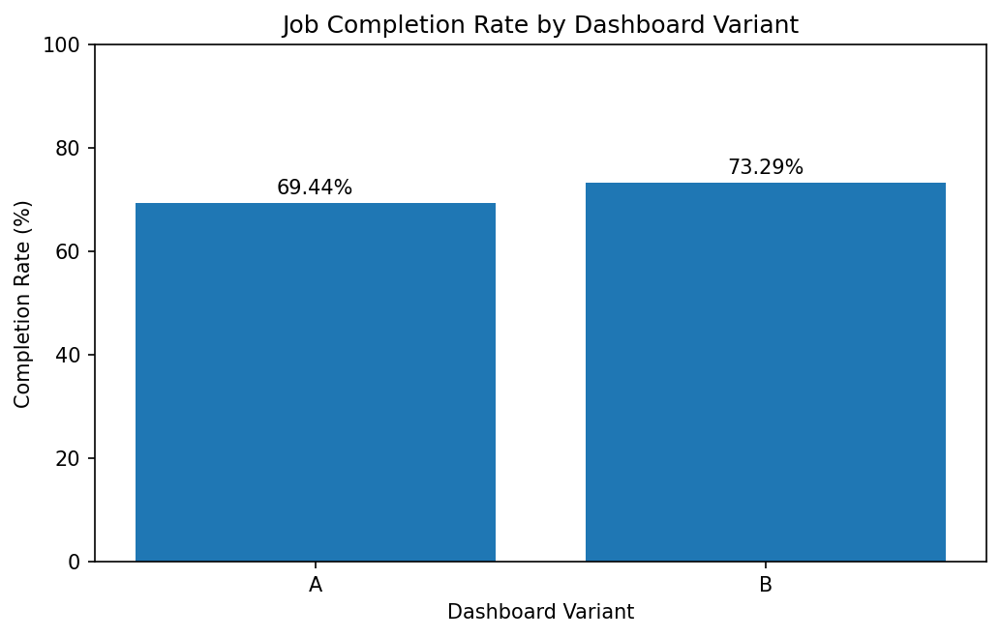

# 🚀 A/B Testing Framework for GPU Cloud Dashboard Optimization


## Overview

This project simulates a real-world A/B testing framework for GPU cloud infrastructure optimization.

The objective is to evaluate whether an improved GPU cloud dashboard experience (**Variant B**) can increase GPU job completion rates compared to a standard dashboard (**Variant A**).

The project combines:

* Product experimentation methodology
* Synthetic A/B test simulation
* Statistical hypothesis testing
* GPU workload analytics
* Dashboard KPI visualization

---

# 📌 Business Problem

GPU cloud platforms often struggle with:

* Long-running workloads
* High GPU resource demand
* Spot instance interruptions
* Distributed worker instability

This project simulates how a smarter dashboard experience could improve operational outcomes by helping users make better workload scheduling decisions.

---

# 🧪 Experiment Design

## Control Group — Variant A

Baseline dashboard experience.

## Treatment Group — Variant B

Improved dashboard experience with simulated optimization benefits.

Variant B receives a simulated treatment effect:

```python
+4% completion probability
```

---

# ⚙️ Simulation Logic

Each workload begins with a baseline completion probability:

```python
completion_probability = 0.72
```

The probability is dynamically adjusted based on workload complexity:

| Condition           | Adjustment |
| ------------------- | ---------- |
| Duration > 24 hours | -12%       |
| GPU Request > 4     | -8%        |
| Worker Count > 10   | -6%        |
| Spot Job            | -5%        |
| Variant B           | +4%        |

The final job outcome is generated probabilistically using randomized Bernoulli simulation.

---

# 📊 A/B Testing Metrics

The project evaluates:

* Completion Rate
* Absolute Lift
* Relative Lift
* Statistical Significance
* Confidence Intervals

Example output:

| Metric            | Value   |
| ----------------- | ------- |
| A Completion Rate | 69.44%  |
| B Completion Rate | 73.29%  |
| Absolute Lift     | 3.86%   |
| Relative Lift     | 5.55%   |
| P-value           | < 0.001 |

---

# 📈 Dashboard Results

## Experiment Dashboard


---

## Absolute Lift Visualization


---

## Completion Rate Comparison



---

# 🧠 Key Insights

* Variant B consistently outperformed Variant A
* The treatment effect produced statistically significant improvement
* The simulated experiment successfully recovered the injected uplift
* Dashboard optimization improved expected operational outcomes

---

# 🛠️ Technologies Used

* Python
* Pandas
* NumPy
* SciPy
* Matplotlib
* Seaborn
* Jupyter Notebook

---

# 📂 Repository Structure

```bash
├── AB.ipynb
├── README.md
├── Dashboard.png
├── absolute_lift.png
├── job_completion_rate_by_dashboard_variant.png
├── job_info_df.csv
└── node_info_df.csv
```

---

# 🎯 Learning Outcomes

This project demonstrates:

* Experimental design principles
* Synthetic A/B test generation
* Product analytics workflows
* Statistical significance testing
* KPI measurement and uplift analysis
* Probability-based outcome simulation

---

# 🔮 Future Improvements

Potential extensions:

* Bayesian A/B testing
* Multi-variant experimentation
* Sequential testing
* Real-time monitoring dashboards
* Machine learning driven treatment assignment
* Time-series experimentation analysis

---

# 👤 Author

Built as a product analytics and experimentation simulation project focused on GPU cloud infrastructure optimization and experimentation methodology.
