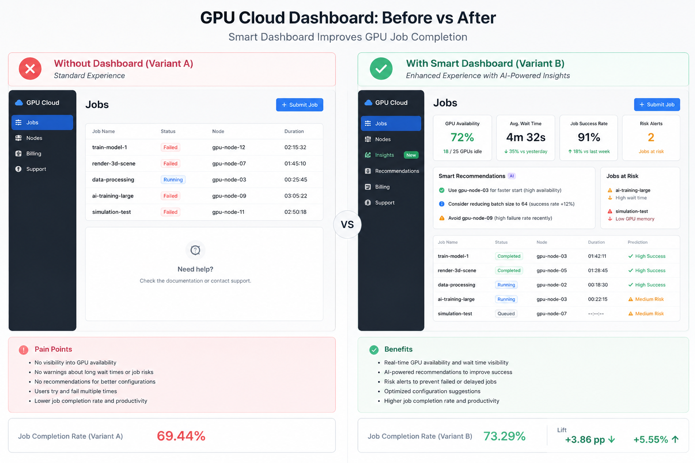

# 🚀 A/B Testing Framework for GPU Cloud Dashboard Optimization



## Overview

This project simulates a real-world A/B testing framework for GPU cloud infrastructure optimization.

The objective is to evaluate whether an improved GPU cloud dashboard experience (**Variant B**) can increase GPU job completion rates compared to a standard dashboard (**Variant A**).

The project combines:

* Product experimentation methodology
* Synthetic A/B test simulation
* Statistical hypothesis testing
* GPU workload analytics
* Dashboard KPI visualization

---

# 📌 Business Problem

GPU cloud platforms often struggle with:

* Long-running workloads
* High GPU resource demand
* Spot instance interruptions
* Distributed worker instability

This project simulates how a smarter dashboard experience could improve operational outcomes by helping users make better workload scheduling decisions.

---

# 🧪 Experiment Design

## Control Group — Variant A

Baseline dashboard experience.

## Treatment Group — Variant B

Improved dashboard experience with simulated optimization benefits.

Variant B receives a simulated treatment effect:

```python
+4% completion probability
```

---

# ⚙️ Simulation Logic

Each workload begins with a baseline completion probability:

```python
completion_probability = 0.72
```

The probability is dynamically adjusted based on workload complexity:

| Condition           | Adjustment |
| ------------------- | ---------- |
| Duration > 24 hours | -12%       |
